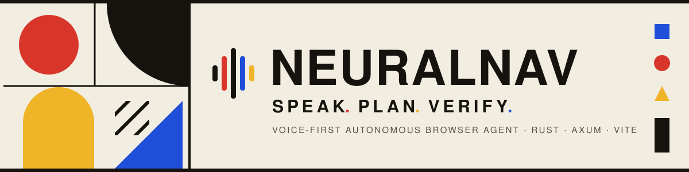
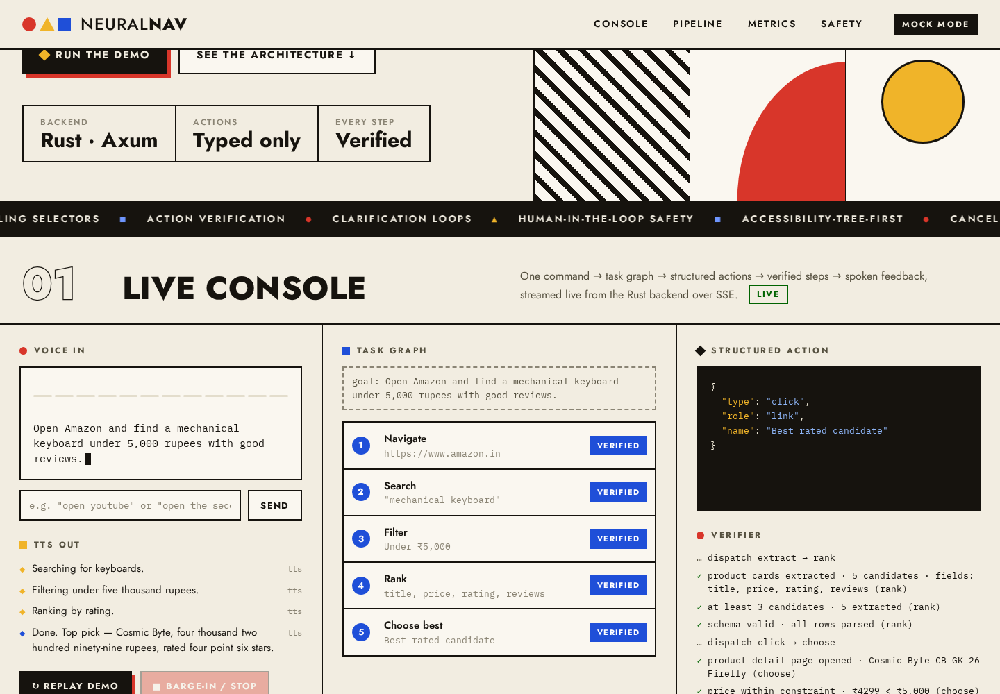
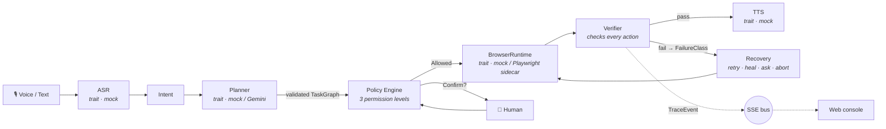
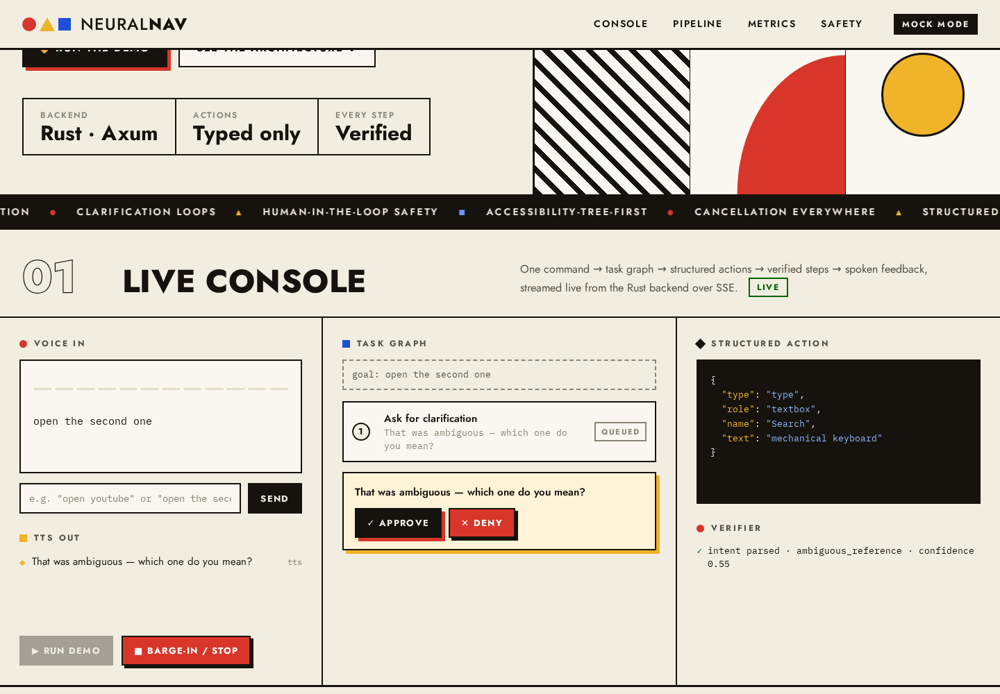

<div align="center">



<br/>

[](rust-toolchain.toml)
[](#-testing--evals)
[](#-quickstart)
[](web/)
[](#license)

**A voice-first autonomous browser agent, built Rust-first.**
It hears a command, decomposes it into a validated task graph, executes structured
browser actions, **verifies every step**, recovers from classified failures — and
streams the whole trace live to a Bauhaus console with spoken feedback and instant barge-in.

[Quickstart](#-quickstart) · [How it works](#-how-it-works) · [The demo](#-the-demo) ·
[Workspace](#-workspace) · [API](#-http-api) · [Guardrails](#-guardrails) ·
[Testing](#-testing--evals) · [Docs](#-documentation)

</div>

---

## ● The demo

> *"Open Amazon and find a mechanical keyboard under 5,000 rupees with good reviews."*

One spoken (or typed) command becomes a five-node task graph — **navigate → search →
filter → rank → choose** — each node dispatched as strict JSON, verified against page
state, and narrated back over TTS. Stop it mid-flight with one click; the
`CancellationToken` halts speech mid-word and skips every pending node.

<div align="center">

<br/><sub><b>The live console after a full run</b> — every node <code>VERIFIED</code>, the chosen structured action, and the verifier's evidence trail.</sub>
</div>

<br/>

Runs entirely on deterministic mock adapters: **no Gemini key, no microphone, no real
browser, no paid services** — and finishes in under 8 seconds (enforced by an
integration test).

## ▲ Quickstart

```sh
# 1 · backend (mock mode — nothing to configure)
cargo run -p neuralnav-server              # → http://localhost:4173

# 2 · frontend
cd web && pnpm install && pnpm dev         # → http://localhost:5173 (proxies /api)
```

Or serve the built frontend straight from the Rust binary:

```sh
cd web && pnpm install && pnpm build && cd ..
cargo run -p neuralnav-server              # → everything on http://localhost:4173
```

Open the console and press **▶ Run demo**. Then try typing
`open the second one` — the planner refuses to guess and asks you to clarify.

<details>
<summary><b>Headless demo (curl only)</b></summary>

```sh
curl -N localhost:4173/api/events &                                   # watch the trace
curl -X POST localhost:4173/api/command \
     -H 'Content-Type: application/json' -d '{"demo":true}'           # run it
curl -X POST localhost:4173/api/stop                                  # barge in
```

</details>

## ■ How it works

**The rule:** never `LLM → browser`. Always
`LLM proposes → validator approves → policy gates → executor runs → verifier confirms`.



Three properties carry the whole design:

| | Principle | Enforcement |
| --- | --- | --- |
| ● | **Structured actions only** | The planner's output deserializes into a *closed* Rust enum. `{"type":"eval_js"}` fails validation before it can reach any browser — pinned by tests. The Playwright worker has **no evaluate command at all.** |
| ▲ | **Verify every action** | "Dispatched" ≠ "succeeded". Every node returns labelled checks (`URL is destination`, `result count 1,204 → 312`, …); failures are classified into a `FailureClass` and routed to a recovery strategy. |
| ■ | **Cancellation everywhere** | One `CancellationToken` per run, threaded through every sleep, utterance, browser action and confirmation wait. Stop settles in &lt;500 ms — measured, not hoped. |

### Human-in-the-loop

Ambiguous commands and sensitive actions park the run and ask — approve or deny from
the console (or `POST /api/confirm`):

<div align="center">

<br/><sub><b>"open the second one"</b> → the planner asks instead of guessing; the run resumes on your answer.</sub>
</div>

## ● Workspace

```text
neuralnav/
├── crates/
│   ├── core/         ● closed action enum · task-graph DAG validation · trace events · failure taxonomy
│   ├── planner/      ▲ Planner trait · MockPlanner · GeminiPlanner (strict JSON → validate → retry → fallback)
│   ├── browser/      ■ BrowserRuntime trait · mock runtime · Playwright sidecar · verifier · recovery · adblock · proxy
│   ├── voice/        ● AsrAdapter / TtsAdapter traits · cancellable mocks · barge-in controller
│   ├── guardrails/   ▲ policy engine: Allowed / Blocked / ConfirmationRequired
│   ├── server/       ■ Axum routes · SSE broadcast · session orchestrator
│   └── evals/        ● labelled dataset · intent & validity metrics · run-evals binary
├── workers/
│   └── playwright-worker/   Node sidecar — JSON-lines stdio, structured commands only
└── web/                     Vite + TS console — pure reducer over TraceEvents, reconnecting SSE
```

**Mock vs real — swappable by env var, identical traits:**

| Layer | Mock (default) | Real (opt-in) |
| --- | --- | --- |
| Planner | keyword task-graphs + clarification | `USE_REAL_PLANNER=true` + `GEMINI_API_KEY` — falls back to mock on *any* failure |
| Browser | deterministic Amazon flow, realistic latencies | `USE_REAL_BROWSER=true` → Playwright Chromium sidecar |
| ASR / TTS | canned transcript · time-based cancellable speech | trait slots reserved (audio belongs client-side) |

<sub>Full variable reference in [`.env.example`](.env.example). A pure-Rust CDP runtime is reserved behind the `cdp` feature flag — deliberately unimplemented while Rust CDP crates lack role/name locators (see [`ASSUMPTIONS.md`](ASSUMPTIONS.md)).</sub>

## ▲ HTTP API

| Endpoint | Does |
| --- | --- |
| `GET  /health` | liveness |
| `GET  /api/state` | session snapshot — status, transcript, graph, recent events, adapter modes |
| `POST /api/session/start` | reset to a fresh session |
| `POST /api/command` | `{text?, audio?, demo?}` — start a run (`409` while one is active) |
| `POST /api/stop` | cancel the run, stop TTS mid-word, emit `UserStopped` |
| `POST /api/confirm` | `{approved}` — resolve a pending confirmation / clarification |
| `GET  /api/events` | **SSE** stream of `TraceEvent` JSON |

Every state change is a typed trace event — `plan_created`, `action_dispatched`,
`action_verified`, `recovery_attempted`, `user_confirmation_requested`,
`tts_spoken`, … — one bus feeding both the UI and your `curl -N`.

## ■ Guardrails

| | Level 1 · Read-only | Level 2 · Interactive | Level 3 · Restricted |
| --- | :---: | :---: | :---: |
| navigate / scroll / extract | ✓ | ✓ | ✓ |
| click / type | ✗ blocked | ✓ | ✓ |
| payment · checkout · delete · send | ✗ blocked | 🙋 confirm | 🙋 confirm |

- **CAPTCHAs are never automated** — blocked at every level, paused for the human at runtime.
- **Payments are never automatic** — there is no code path to a payment-shaped action that skips confirmation.
- **Stop always wins** — barge-in cancels the token, halts TTS, resolves pending confirmations as denied.

Details: [`docs/guardrails.md`](docs/guardrails.md)

## ● Testing & evals

```
cargo test        → 53 passing   (schema · DAG · policy · mock runtime · cancellation · e2e orchestrator)
cd web && pnpm test → 5 passing  (console state reducer: run / stop / confirm / caps)
cargo run -p neuralnav-evals --bin run-evals
```

| Measured | Result | Enforced by |
| --- | --- | --- |
| Intent accuracy | **10/10** | `mock_planner_clears_quality_bars` (≥ 90%) |
| Clarification accuracy | **10/10** | same test (≥ 90%) |
| Task-graph validity | **100%** | same test (= 100%) |
| Full demo wall-clock | **< 8 s** | `demo_runs_end_to_end_under_eight_seconds` |
| Stop settle time | **< 500 ms** | `stop_cancels_the_run_immediately` |
| Demo replayability | **✓** | `navigation_is_replayable` (regression from a real bug) |

## ▲ Documentation

| | |
| --- | --- |
| [`docs/architecture.md`](docs/architecture.md) | layers, run lifecycle, cancellation, SSE healing, why a Node sidecar |
| [`docs/actions.md`](docs/actions.md) | the action contract, task-graph schema, targeting rules |
| [`docs/guardrails.md`](docs/guardrails.md) | permission levels, sensitivity detection, failure → recovery table |
| [`docs/evals.md`](docs/evals.md) | metrics, dataset, quality bars |
| [`workers/playwright-worker/README.md`](workers/playwright-worker/README.md) | sidecar protocol & security model |
| [`ASSUMPTIONS.md`](ASSUMPTIONS.md) | all 19 deliberate simplifications, in one honest list |

## ■ Roadmap

Session multiplexing → Web Speech API capture in the console → clarification answers
fed into a re-plan loop → vision-fallback grounding in the sidecar → full EasyList
ingestion → pure-Rust CDP runtime once role/name locators are viable.

---

<div align="center">

**● ▲ ■**

*Form follows function.*

<sub>Built with Rust · Axum · Tokio · Vite · TypeScript · Playwright — MIT license</sub>

</div>
